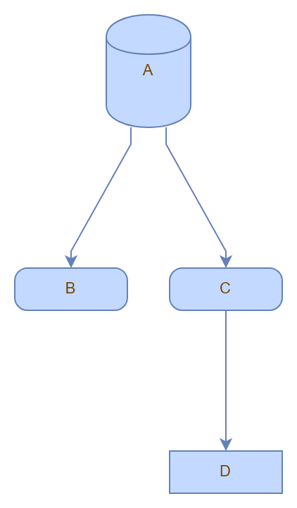

# Experiment with mxGraph, Puppeteer and draw.io

## Goals

* Automatically generate graph images using `mxGraph` running in a host container using `static-server` and headless browser automation with `puppeteer`.
* Automatically generate `drawio` graphs using the above `mxGraph` XML

## Examples

### People, Process, Technology

This example demonstrates the use of custom styles, support for draw.io links with the use of `UserObject`, and ensures edges are below vertices (shapes). View the [clickable diagram on draw.io](https://www.draw.io/?lightbox=1&target=self&highlight=0000ff&edit=_blank#Uhttps%3A%2F%2Fraw.githubusercontent.com%2Fericis%2Flab-mxgraph-autograph%2Fmaster%2Fpeople-process-technology.drawio).

### Generic shapes graph

This example demonstrates basic, connected shapes. View the [generated diagram on draw.io](https://www.draw.io/?lightbox=1&target=self&highlight=0000ff&edit=_blank#Uhttps%3A%2F%2Fraw.githubusercontent.com%2Fericis%2Flab-mxgraph-autograph%2Fmaster%2Fgraph.drawio).

## Resources

* [mxGraph User Manual for JS](https://jgraph.github.io/mxgraph/docs/manual.html)
* [mxGraph API](https://jgraph.github.io/mxgraph/docs/js-api/files/view/mxGraph-js.html)
* [mxGraph examples](https://jgraph.github.io/mxgraph/javascript/index.html)
* [mxGraph source examples](https://github.com/jgraph/mxgraph/tree/master/javascript/examples)
* [draw.io shape styles](https://about.draw.io/shape-styles/)
* [draw.io conversion tools](https://jgraph.github.io/drawio-tools/tools/convert.html)
* [puppeteer](https://pptr.dev/)
* [mermaidjs inspiration](https://mermaidjs.github.io/)
* [jGraph NodeJS image export](https://github.com/jgraph/draw-image-export2)
